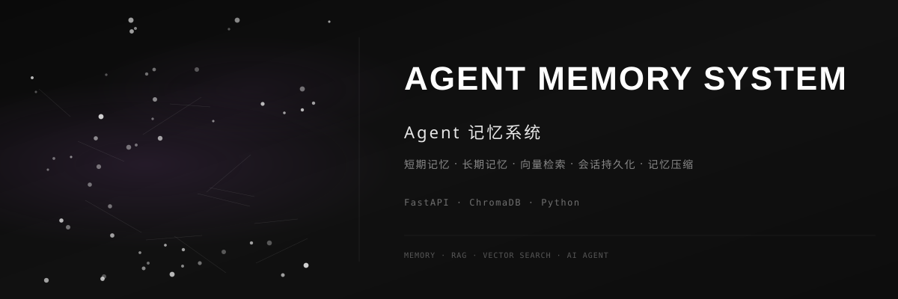

<div align="center">



<br>

### 🧠 Agent 记忆系统

[](https://github.com/dirjaker/agent_memory_system/stargazers)
[](https://github.com/dirjaker/agent_memory_system/network/members)
[](https://github.com/dirjaker/agent_memory_system/graphs/contributors)
[](https://github.com/dirjaker/agent_memory_system/blob/dev/LICENSE)

</div>

---

## ✨ 功能特性

| 功能 | 描述 |
|------|------|
| ⚡ **短期记忆** | 当前会话上下文管理，滑动窗口机制 |
| 💾 **长期记忆** | 持久化存储历史对话和知识 |
| 🔍 **向量检索** | 基于 ChromaDB 的语义相似度搜索 |
| 🗜️ **记忆压缩** | 自动摘要和压缩冗余记忆，节省存储 |
| 📉 **记忆衰减** | 模拟人类记忆衰减机制，优先保留重要信息 |
| 🔄 **会话持久化** | 跨会话记忆恢复和上下文延续 |


## 🚀 快速开始

```bash
# 克隆项目
git clone https://github.com/dirjaker/agent_memory_system.git
cd agent_memory_system

# 创建虚拟环境
conda create -n agent_memory_system python=3.12 -y
conda activate agent_memory_system

# 安装依赖
pip install -r requirements.txt

# 运行项目
python main.py
```

## 🛠️ 技术栈

| 层级 | 技术 |
|------|------|
| **后端** | FastAPI, SQLAlchemy |
| **向量库** | ChromaDB, Sentence Transformers |
| **存储** | SQLite, Redis |
| **LLM** | DeepSeek, OpenAI |

## 📝 开发日志

- [x] 三层记忆架构
- [x] 向量检索引擎
- [x] 会话持久化
- [x] 记忆压缩
- [x] 记忆衰减机制
- [ ] 记忆可视化
- [ ] 多 Agent 记忆共享
- [ ] 记忆导出/导入

## 📄 许可证

[MIT License](LICENSE)

---

<div align="center">

🔗 **GitHub**: [dirjaker/agent_memory_system](https://github.com/dirjaker/agent_memory_system)

⭐ 如果这个项目对你有帮助，请给一个 Star 支持一下！

</div>
